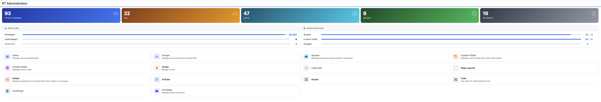
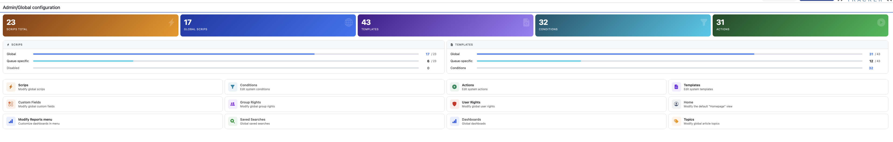
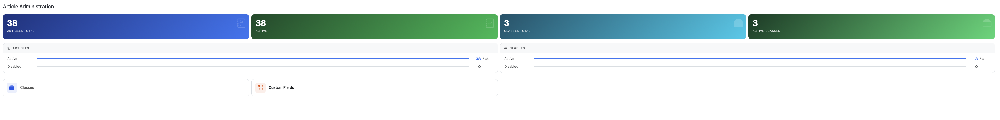
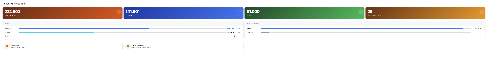
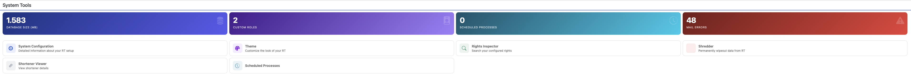

# RT-Extension-AdminDashboard

Replaces RT's default admin overview pages with live-statistics dashboards.
The bestpractical.com news iframe is gone; every admin section gets a
full-width view with animated stat cards, progress-bar info cards, and
responsive icon-grid navigation.

## Covered pages

| Page | Replaces |
|---|---|
| `/Admin/` | Main admin overview |
| `/Admin/Global/` | Global configuration overview |
| `/Admin/Articles/index.html` | Article administration overview |
| `/Admin/Assets/` | Asset administration overview |
| `/Admin/Tools/` | System tools overview |

## Screenshots

### Admin — `/Admin/`


### Global — `/Admin/Global/`


### Articles — `/Admin/Articles/`


### Assets — `/Admin/Assets/`


### Tools — `/Admin/Tools/`


## Features

- **Animated stat cards** — key numbers count up on page load; all numbers
  use `toLocaleString` formatting
- **Progress-bar info cards** — active/disabled breakdowns with proportional
  fill bars; theme-aware via Bootstrap 5 `var(--bs-*)` variables
- **Responsive icon grid** — every menu item as a hover-lift card (4 columns
  desktop → 2 columns mobile); picks up items registered by other plugins
  automatically
- **Per-section stats** included:
  - *Admin*: ticket totals (new/active/resolved/deleted), user counts
    (privileged/unprivileged/disabled), queue and custom field counts
  - *Global*: scrips (total/global/queue-specific/disabled), templates
    (global/queue-specific), conditions and actions counts
  - *Articles*: article and class counts (active vs. disabled)
  - *Assets*: asset totals by status (allocated/in-use/other), catalog
    counts (active vs. disabled)
  - *Tools*: database size (MB), custom roles, scheduled processes,
    mail error count
- **10-minute per-process cache** — all stats queries run once per fcgid
  worker every 10 minutes; no ORM timeouts
- **Dark-mode and theme-aware** — Bootstrap 5 CSS variables throughout;
  tested with RT 6 default, Nord, and dark themes
- **No external dependencies** — Bootstrap Icons and Bootstrap 5 are
  bundled with RT 6; no CDN calls
- **Fully localised** — 37 languages, all extension-specific strings
  translated

## Requirements

- Request Tracker 5.0.0 or later (developed and tested on RT 6)

## Installation

```bash
perl Makefile.PL
make
sudo make install
```

Clear the Mason cache and restart Apache:

```bash
sudo rm -rf /opt/rt6/var/mason_data/obj/*
sudo service apache2 restart
```

## Plugin Registration

Add to `/opt/rt6/etc/RT_SiteConfig.d/002_Plugins.pm` (or your site config):

```perl
Plugin('RT::Extension::AdminDashboard');
```

No further configuration needed.

## How it works

All statistics are fetched via direct SQL on `$RT::Handle->dbh` to avoid
RT's ORM query timeout (`$DatabaseQueryTimeout`). The menu items are read
from RT's own menu tree after `BuildMainMenu => 1` has populated it, so
any admin items registered by other plugins appear automatically.

Shared CSS and the counter animation are factored into two Mason components
(`html/Admin/Elements/AdminDashboardCSS` and `AdminDashboardJS`) included
by all dashboard pages.

| Template | Purpose |
|---|---|
| `html/Admin/index.html` | Main admin dashboard |
| `html/Admin/Global/index.html` | Global configuration dashboard |
| `html/Admin/Articles/index.html` | Article administration dashboard |
| `html/Admin/Assets/index.html` | Asset administration dashboard |
| `html/Admin/Tools/index.html` | System tools dashboard |
| `html/Admin/Elements/AdminDashboardCSS` | Shared CSS (cards, bars, grid) |
| `html/Admin/Elements/AdminDashboardJS` | Shared counter animation JS |
| `html/Admin/Elements/Portal` | Widget-only fallback (legacy) |

## Author

Torsten Brumm

## License

GNU General Public License v2
